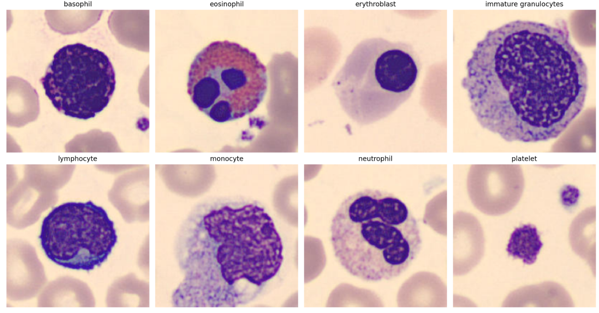

# Artificial Neural Networks and Deep Learning, Challenge 2024-2025 
This is the repository for the two challenges of the Artificial Neural Networks and Deep Learning course held at Politecnico di Milano.

### 1) Image Classification Challenge - Blood cells classification🦠
Given a [dataset](https://www.kaggle.com/datasets/francescolomastro01/an2dl-2024-2025-challenge-1) of blood cells (96x96, RGB), the goal of the challenge is to classify them according to 8 classes.

#### Dataset Details
- Image Size: 96x96
- Color Space: RGB 
- Number of Classes: 8
#### Class Labels
- 0: Basophil
- 1: Eosinophil
- 2: Erythroblast
- 3: Ommature Granulocytes
- 4: Lymphocyte
- 5: Monocyte
- 6: Neutrophil
- 7: Platelet 

🐍 This repository contains all [python notebooks](/Challenge%201%20-%20Image%20Classification/Notebooks/) we used 

📚 This repository contains a final [report](/Challenge%201%20-%20Image%20Classification/Report_Challenge_1_ANNDL.pdf) is available in which all the phases of the project are described

🏆 At the end of the challenge, we reached an accuracy of 0.86 on the real Test set. We obtained a score of 5.5/5.5 for this challenge. 

##

### 2) Image Segmentation Challenge - Mars image segmentation 👽

Given a [dataset](https://www.kaggle.com/competitions/an-2-dl-2024-2025-homework-2/data) of Mars landscapes captured by different Mars Rovers (64x128, Grayscale), the task involves to produce a same-size image segmentation.

  

#### Dataset Details
- Image Size: 64x128
- Color Space: Grayscale
- Number of Classes: 5
#### Class Labels
- 0: Background
- 1: Soil
- 2: Bedrock
- 3: Sand
- 4: Big Rock

🐍 This repository contains all [python notebooks](/Challenge%202%20-%20Image%20Segmentation/Notebooks/) we used 

📚 A final [report](/Challenge%202%20-%20Image%20Segmentation/Report_challenge_2_ANNDL.pdf) is available in which all the phases of the project are described

🏆 At the end of the challenge, we reached a Mean Intersection Over Union (MIOU) of 0.67 on the real Test set. We obtained a score of 5.5/5.5 for this challenge. 

---
✔️ Final Evaluation: 5.5+5.5 = 11/11